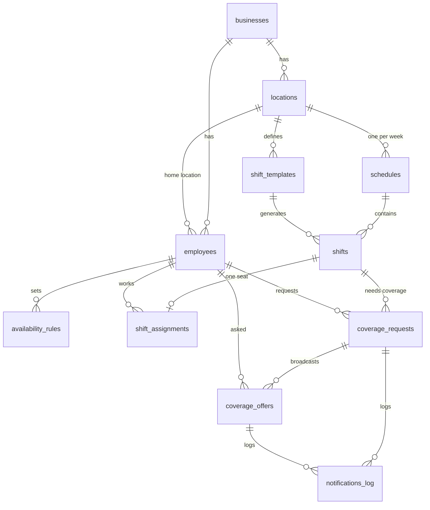

# Database Schema

The Scheduler database (Supabase / PostgreSQL). Migrations live in
`supabase/migrations/`; seed data in `supabase/seed.sql`. This document is the
human-readable companion — regenerate/update it whenever the migrations change.

Apply everything to a fresh DB with:

```bash
npx supabase db reset   # runs all migrations, then seed.sql
```

---

## Conventions

- **Spine columns.** Every table has `id uuid PK` (default `gen_random_uuid()`),
  `created_at timestamptz`, and `updated_at timestamptz` (kept current by the
  shared `set_updated_at()` trigger). Every table except `businesses` also has
  `business_id uuid NOT NULL`.
- **Single-tenant, multi-tenant-ready.** `business_id` **defaults to a hardcoded
  sentinel** — `00000000-0000-0000-0000-000000000001` — which is the one seeded
  business. Inserts can omit `business_id` today. Multi-tenancy later just means
  stop relying on the default and scope every query by `business_id` (already the
  pattern). Row-level security (SCH-7) will enforce tenant + role isolation.
- **Timestamps are UTC `timestamptz`.** Every point-in-time column is
  `timestamptz`, stored UTC, rendered in the business timezone
  (`businesses.settings.timezone`, default `America/Vancouver`).
- **Wall-clock times are naive on purpose.** `availability_rules` and
  `shift_templates` use `time`/`date` (no zone). Recurring availability and
  weekly demand are inherently *wall-clock* ("Mondays 09:00–17:00 in the
  business's timezone"), not UTC instants. This is the one legitimate place naive
  temporal types are correct; concrete `shifts` are materialized into `timestamptz`.
- **Enums.** Fixed domains are native Postgres enum types (see below) for type
  safety and clean generated TypeScript.

---

## Enum types

| Enum | Values |
|---|---|
| `user_role` | `employee`, `manager`, `admin` |
| `schedule_status` | `draft`, `published` |
| `availability_kind` | `recurring`, `exception` |
| `coverage_trigger_type` | `sick_call`, `day_off`, `direct_swap` |
| `trade_type` | `two_way`, `one_way` |
| `coverage_status` | `open`, `tier1_broadcast`, `tier2_broadcast`, `escalated`, `covered`, `cancelled`, `manager_resolved` |
| `offer_response` | `pending`, `accepted`, `declined`, `expired` |
| `assignment_source` | `generator`, `manager`, `claim`, `swap` |
| `notification_channel` | `sms`, `email` |
| `notification_status` | `queued`, `sent`, `delivered`, `failed` |

---

## ERD



Every table also carries a `business_id → businesses.id` edge (omitted above).

---

## Tables

### `businesses`
The tenant root. One row for now.

| Column | Type | Notes |
|---|---|---|
| `id` | uuid PK | |
| `name` | text | |
| `settings` | jsonb | see shape below; CHECK-validated |

`settings` shape:

```json
{
  "approval_mode": "auto_publish | require_approval",
  "timezone": "America/Vancouver",
  "wait_windows": {
    "sick_call": { "tier1_minutes": 20,   "tier2_minutes": 20 },
    "day_off":   { "tier1_minutes": 1440, "tier2_minutes": 1440 }
  }
}
```

CHECK `businesses_settings_valid`: `approval_mode` ∈ {auto_publish, require_approval},
and keys `timezone` + `wait_windows` present.

### `locations`

| Column | Type | Notes |
|---|---|---|
| `business_id` | uuid FK → businesses (cascade) | |
| `name` | text | |
| `address` | text NULL | |

Timezone lives on the business, not per-location (single business timezone per
spec). A `locations.timezone` override can be added additively later.

### `employees`

| Column | Type | Notes |
|---|---|---|
| `business_id` | uuid FK → businesses (cascade) | |
| `user_id` | uuid UNIQUE FK → auth.users (set null) | NULL = invited, not yet registered |
| `full_name` | text | |
| `email` | text | unique per business via `lower(email)` index |
| `phone` | text NULL | E.164, normalized in app on save |
| `role` | `user_role` | default `employee` |
| `skills` | text[] | default `{}` |
| `max_weekly_hours` | numeric(5,2) | default 40, `>= 0` |
| `home_location_id` | uuid FK → locations (set null) | |
| `active` | boolean | default true; deactivate rather than delete |

Unique index `employees_business_email_key` on `(business_id, lower(email))`.

### `availability_rules`
Recurring weekly windows **and** one-off date exceptions in one table,
discriminated by `kind`.

| Column | Type | Notes |
|---|---|---|
| `business_id` | uuid FK → businesses (cascade) | |
| `employee_id` | uuid FK → employees (cascade) | |
| `kind` | `availability_kind` | `recurring` or `exception` |
| `weekday` | smallint NULL | 0=Sun…6=Sat; set for `recurring` |
| `exception_date` | date NULL | set for `exception` |
| `start_time` | time NULL | wall-clock (business tz) |
| `end_time` | time NULL | wall-clock |
| `is_available` | boolean | default true; exceptions are usually `false` (blackout) |

CHECKs: `recurring` ⇒ weekday set, exception_date null, both times set;
`exception` ⇒ exception_date set, weekday null; `start_time < end_time` when both present.

### `shift_templates`
Per-location weekly demand. One row = one skill on one weekday at one location.

| Column | Type | Notes |
|---|---|---|
| `business_id` | uuid FK → businesses (cascade) | |
| `location_id` | uuid FK → locations (cascade) | |
| `weekday` | smallint | 0–6 |
| `start_time` | time | wall-clock |
| `end_time` | time | wall-clock, `> start_time` |
| `required_skill` | text | |
| `headcount` | int | default 1, `> 0`; expands into N shift seats |
| `active` | boolean | default true |

### `schedules`
One weekly schedule per location.

| Column | Type | Notes |
|---|---|---|
| `business_id` | uuid FK → businesses (cascade) | |
| `location_id` | uuid FK → locations (cascade) | |
| `week_start` | date | |
| `status` | `schedule_status` | default `draft` |
| `generated_at` | timestamptz NULL | |
| `published_at` | timestamptz NULL | |

UNIQUE `(location_id, week_start)`.

### `shifts`
Concrete seats materialized from templates for a specific week. One seat per row.

| Column | Type | Notes |
|---|---|---|
| `business_id` | uuid FK → businesses (cascade) | |
| `schedule_id` | uuid FK → schedules (cascade) | |
| `location_id` | uuid FK → locations (cascade) | denormalized for querying |
| `template_id` | uuid NULL FK → shift_templates (set null) | NULL = manually added |
| `starts_at` | timestamptz | UTC instant |
| `ends_at` | timestamptz | `> starts_at` |
| `required_skill` | text | |

### `shift_assignments`
At most one assignee per shift seat.

| Column | Type | Notes |
|---|---|---|
| `business_id` | uuid FK → businesses (cascade) | |
| `shift_id` | uuid UNIQUE FK → shifts (cascade) | one seat, one assignee |
| `employee_id` | uuid FK → employees (restrict) | |
| `assigned_via` | `assignment_source` | default `generator` |
| `pending_approval` | boolean | default false; true = claimed, awaiting manager |

An **unfilled seat** is simply a `shifts` row with no `shift_assignments` row.

### `coverage_requests`
The core of the app. All three triggers run through this one table.

| Column | Type | Notes |
|---|---|---|
| `business_id` | uuid FK → businesses (cascade) | |
| `shift_id` | uuid FK → shifts (cascade) | shift needing coverage / A's shift (swap) |
| `requested_by` | uuid FK → employees (restrict) | reporter / requester / initiator A |
| `trigger_type` | `coverage_trigger_type` | |
| `trade_type` | `trade_type` NULL | swap only |
| `status` | `coverage_status` | default `open` |
| `covered_by` | uuid NULL FK → employees (restrict) | winning replacement; atomic-claim target |
| `target_employee_id` | uuid NULL FK → employees (restrict) | swap counterparty B |
| `offered_shift_id` | uuid NULL FK → shifts (set null) | B's shift A takes (two-way) |
| `tier1_wait_minutes` | int NULL | **snapshot** from settings at creation |
| `tier2_wait_minutes` | int NULL | **snapshot** |
| `tier_expires_at` | timestamptz NULL | current tier deadline; cron reads this |
| `covered_at` | timestamptz NULL | |
| `time_off_approved_at` | timestamptz NULL | **invariant-guarded** (see below) |
| `resolved_at` | timestamptz NULL | terminal states |
| `notes` | text NULL | |

**Wait-window snapshotting.** `tier1/2_wait_minutes` are copied from
`businesses.settings.wait_windows[trigger_type]` at creation. In-flight requests
keep the window they started with; changing settings only affects new requests.
`tier_expires_at` is set to `now() + current tier window` on entering a broadcast
tier; the tier-timer cron (SCH-19) sweeps `WHERE status IN
('tier1_broadcast','tier2_broadcast') AND tier_expires_at < now()`.

**Atomic claim (SCH-18).** The winner is resolved with a single guarded write:

```sql
UPDATE coverage_requests
   SET covered_by = :employee, status = 'covered', covered_at = now()
 WHERE id = :id AND covered_by IS NULL;   -- check affected rows: 1 = winner, 0 = already covered
```

Constraints:

- **`time_off_approved_requires_coverage`** — `time_off_approved_at IS NULL OR
  status = 'covered'`. Enforces domain invariant #1 (time-off is never approved
  before coverage is confirmed) *at the database layer*. See below.
- **`covered_requires_covered_by`** — `status <> 'covered' OR covered_by IS NOT NULL`.
- **`coverage_swap_fields_only_for_swap`** — `trade_type`, `target_employee_id`,
  `offered_shift_id` must be NULL unless `trigger_type = 'direct_swap'`.

### `coverage_offers`
The per-employee ask + response within a broadcast (or the single targeted ask in
a direct swap).

| Column | Type | Notes |
|---|---|---|
| `business_id` | uuid FK → businesses (cascade) | |
| `coverage_request_id` | uuid FK → coverage_requests (cascade) | |
| `employee_id` | uuid FK → employees (cascade) | who was asked |
| `tier` | smallint | 1 or 2 |
| `response` | `offer_response` | default `pending` |
| `notified_at` | timestamptz NULL | |
| `responded_at` | timestamptz NULL | |

UNIQUE `(coverage_request_id, employee_id)` — never ask the same person twice.

### `notifications_log`
Audit trail of every outbound notification ("I never got the text" insurance).

| Column | Type | Notes |
|---|---|---|
| `business_id` | uuid FK → businesses (cascade) | |
| `recipient_employee_id` | uuid NULL FK → employees (set null) | |
| `coverage_request_id` | uuid NULL FK → coverage_requests (set null) | context |
| `coverage_offer_id` | uuid NULL FK → coverage_offers (set null) | context |
| `channel` | `notification_channel` | `sms` / `email` |
| `template` | text | template identifier |
| `status` | `notification_status` | default `queued` |
| `provider` | text NULL | `twilio` / `resend` |
| `provider_message_id` | text NULL | |
| `error` | text NULL | |
| `payload` | jsonb NULL | rendered content snapshot |
| `sent_at` | timestamptz NULL | |

---

## Domain invariant enforcement

Invariant #1 — **"time-off is only approved after coverage is confirmed"** — is
enforced by a **CHECK constraint**, not just application code:

```sql
CONSTRAINT time_off_approved_requires_coverage
  CHECK (time_off_approved_at IS NULL OR status = 'covered')
```

**Why a CHECK and not a trigger:** a CHECK is declarative and evaluated on every
insert/update — it cannot be bypassed, not even by `service_role` or a buggy code
path. It also enforces the correct ordering on the way *out*: an approved request
cannot regress its status away from `covered` without first clearing the approval.

**Trigger alternative (not used):** a `BEFORE INSERT OR UPDATE` trigger could do
the same check imperatively and additionally *auto-clear* `time_off_approved_at`
when a request is un-covered. We prefer the CHECK for its stronger, unbypassable
guarantee; if auto-clearing behavior is ever needed, add a trigger alongside the
CHECK rather than replacing it. Proven by `src/__tests__/db/coverage-invariants.db.test.ts`.

---

## Seed data (`supabase/seed.sql`)

- **1 business** — "Harbour Coffee Co.", `require_approval`, `America/Vancouver`,
  wait-windows (sick_call 20/20 min, day_off 1440/1440 min).
- **2 locations** — Gastown, Kitsilano.
- **12 employees** — 1 admin, 2 managers (one per location), 9 employees
  (incl. 1 inactive to exercise "deactivated excluded from scheduling"), with
  varied skills, weekly-hour caps, and home locations split across both sites.
- **Varied availability** — recurring weekly windows per employee plus a couple
  of one-off blackout exceptions.

`employees.user_id` is NULL in the seed (invited-but-not-registered), matching the
invite-only signup flow; auth users are linked when each employee accepts an invite.
